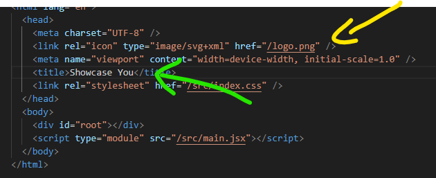
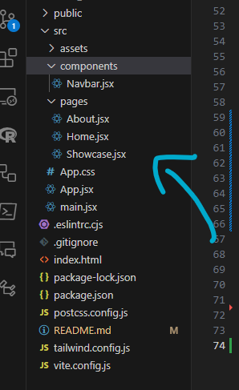

# Website Template

This repository contains a simple website template built using Vite and React. It includes basic pages and components that users can customize to create their own unique website.
As well, you can customize the visual themes to your preference.

## Features

- **Vite + React**: Utilizes Vite for fast and efficient development along with React for building UI components.
- **Tailwind CSS**: Customiable and utility-first approach to styling your components
- **Pages**: Includes Home, About, and Showcase pages as starting templates.
- **Components**: A Navbar component is available for easy navigation.
- **Customization**: Users can modify content, styles, and themes to create a personalized website.

## File Structure

```plaintext
root directory
├── index.html         # Update website tab header and icon
├── /src
│   ├── App.jsx        # Manage pages and routes
│   ├── App.css        # Handle themes and styles
│   ├── /pages
│   │   ├── Home.jsx           # Homepage template
│   │   ├── About.jsx          # About page template
│   │   └── Showcase.jsx       # Showcase page template
│   └── /components
│       └── Navbar.jsx        # Navigation component
└── /public               # Image assets
    └── logo.png
```

## Getting Started

### Clone the Repository

To clone this repository, use the following command by copying and pasting it in a
terminal that you opened inside the folder where you want this stored:

        git clone https://github.com/Enjoyweaver/websiteTemplate.git

After it is downloaded, then paste this into the terminal:

        cd websiteTemplate

To install the necessary dependencies, run:

        npm install

This will install all the required packages and dependencies for the project. And once
it is finished, then you should open the project with VS Code using this command in your terminal:

        code .

## Tutorial

### Browser Tab / Header

To update the browser tab header, go to the index.html file and type the name you want displayed.
And then add your image to the /public folder and update the name of the image. Once you completed your updates,
then press

```bash
ctrl + s
```

at the same time to save your changes and within a few seconds you should see the updates in your browser:

<p align="center">
  
</p>

### Home page

To update your pages, navigate to the pages folder within your projects directory and select the Home.jsx file:

<p align="center">
  
</p>
